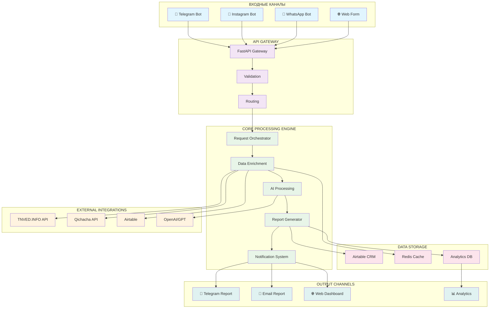
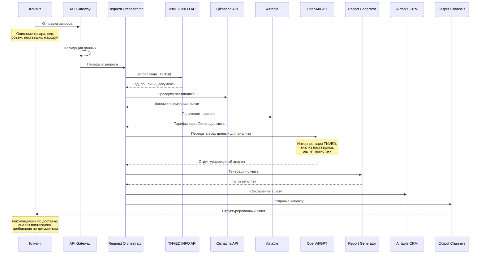
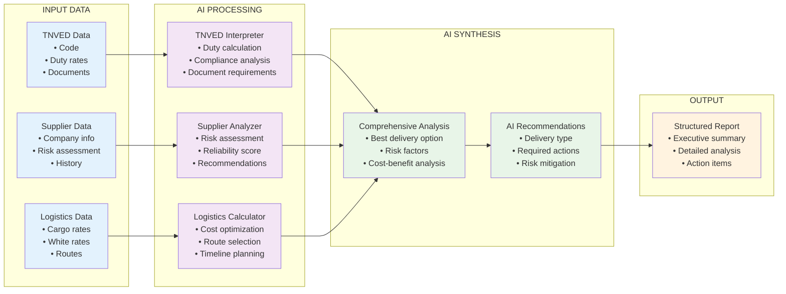
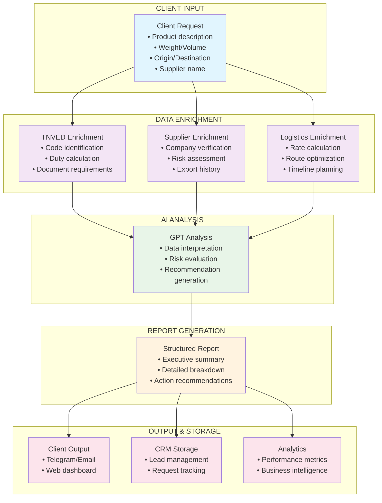
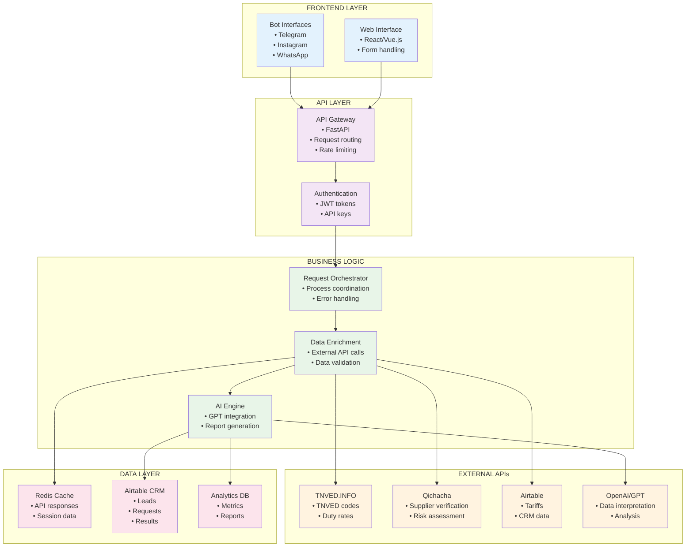

# 🔗 Диаграмма интеграций AI Logistics Hub

## 📊 Общая схема системы

## 🔄 Детальный процесс обработки запроса

## 🧠 AI Processing Flow

## 📊 Data Flow Architecture

## 🔧 Техническая архитектура интеграций

## 📈 Преимущества архитектуры

### **Для клиента:**
- 🎯 **Единый интерфейс** через любой канал
- 📊 **Структурированный отчет** вместо сырых данных
- 🤖 **AI-рекомендации** на основе комплексного анализа
- ⚡ **Быстрый ответ** (2-3 минуты)

### **Для бизнеса:**
- 🔄 **Полная автоматизация** обработки запросов
- 📈 **Масштабируемость** системы
- 📊 **Детальная аналитика** и метрики
- 💼 **CRM интеграция** для управления лидами

### **Технические:**
- 🏗️ **Микросервисная архитектура**
- ⚡ **Кэширование** для оптимизации
- 📝 **Подробное логирование** и мониторинг
- 🛡️ **Отказоустойчивость** и безопасность

Эта архитектура создает полноценную AI-платформу для логистики, которая автоматически обрабатывает запросы клиентов и предоставляет профессиональные рекомендации! 🚀
